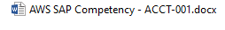
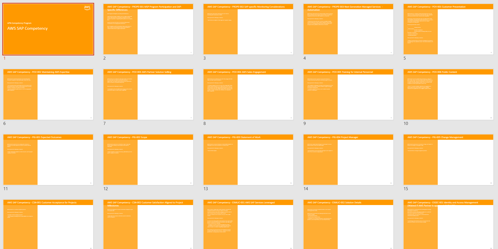

# APN Competency Helper

This package has been built in order to answer to a pragmatic approach and lower a cumbersome effort to build a template folder structure for APN Designations and particularly [APN Competency Program](https://aws.amazon.com/partners/programs/competencies/) and [APN Service Delivery Program](https://aws.amazon.com/partners/programs/service-delivery/).

**Important Note**

This helper refers to official APN self-service assessment checklist that are subject to change in the future. User has to check the validity of the checklist and particluarly that the version of the spreadsheet is up to date BEFORE filling in the documents.

---

The main principe is to automate the generation of a folder tree with different documents to support the Partner during the program achievement and ease the discovery of different evidence by the Auditor.

Easy to use, PMSA works with Partners and generates the package with the helper, providing an already setup tree with all the templates and all the data coming from the official checklists.

The following data is extracted from the `Self-Service checklist` from any Competency and Service Deliveries:

- level 1 - Folder - Worksheet name

- level 2 - Folder - Id of the rule and title of the rule

- level 3 - Word Document with the id, the title and the full description

At the root, are added :

- a copy of the checklist
- a generated presentation with all the different rules

And finally, the helper zips everything in the `var` directory.

## Usage

### Direct Execution on Local Machine

    //Install dependencies
    $ yarn install

    // Generate the javascript file
    $ npm run-script build

    //Run the script
    $ node ./dist/index.js

Type the name of the APN Designation

Select by typing enter

Select the partner path

After execution of the script, the file structure is created in the `var` directory.

### Execution Via Docker

If you like to run this script within a contained environment, you can build a Docker image with

    $ docker image rm -f aws-helper/apn-competency-helper && docker build -t aws-helper/apn-competency-helper .

By specifying an output directory as a volume, you can run the competency helper like this:

    $ docker run -it --name aws-competency-helper -v output:/output aws-helper/apn-competency-helper

After execution of the script, the file structure is created in the `output` directory.

To generate the file structure repeatedly, you can use the following command:

    $ docker container start -i aws-competency-helper

## Troubleshoot

### Script did not download the self service checklist

Update the `competencies.json` file with the correct url and please do a PR to make it accessible for everybody.
